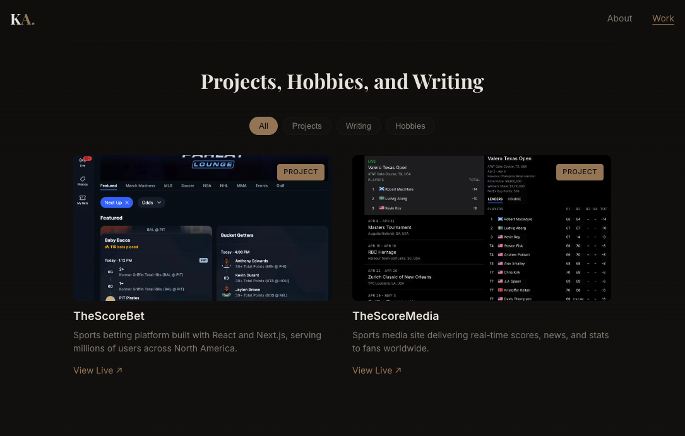

# kendalladkins.dev

```
┌──────────────────────────────────────────────────────────┐
│                                                          │
│  kendalladkins.dev                                       │
│  -------------------                                     │
│                                                          │
│  ▶ Role:      Senior Software Engineer                   │
│  ▶ Stack:     React · TypeScript · Next.js               │
│  ▶ Focus:     Web · AI-Assisted Dev · Unity 2D           │
│  ▶ Built w/:  Next.js · Keystatic · Vercel               │
│  ▶ Uptime:    10+ years in production                    │
│                                                          │
│  Features                                                │
│  --------                                                │
│  · Keystatic CMS     · RSS Feed                          │
│  · SEO Optimized     · Responsive                        │
│  · Vercel Analytics   · CSS Modules                      │
│                                                          │
│  $ open https://kendalladkins.dev                        │
│                                                          │
└──────────────────────────────────────────────────────────┘
```

<a href="https://kendalladkins.dev">
  
</a>

<p>
  <a href="https://kendalladkins.dev">
    
  </a>
</p>


